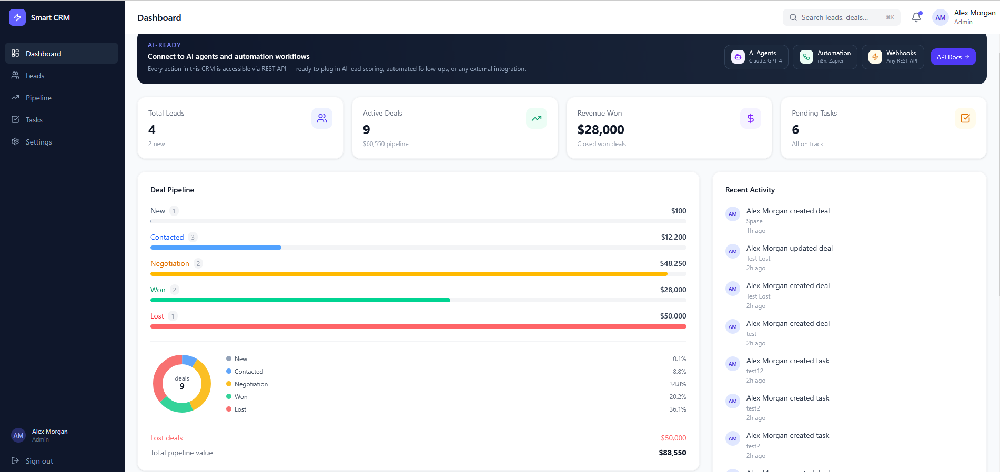
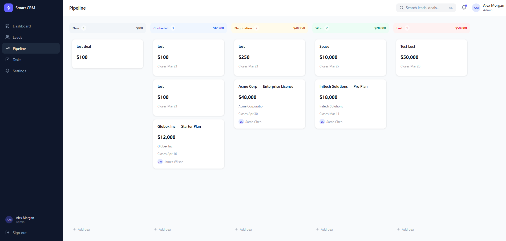
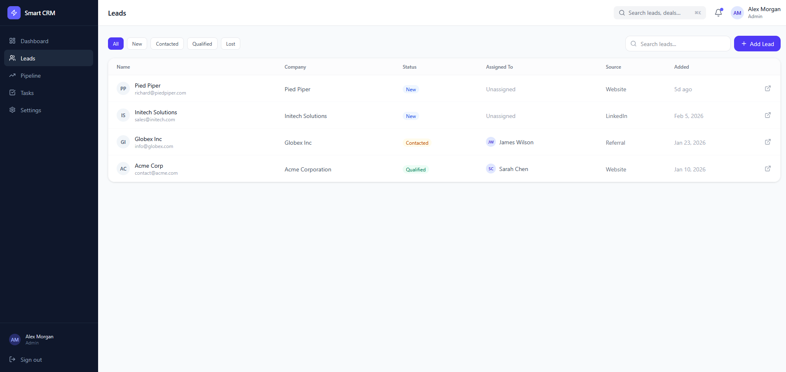
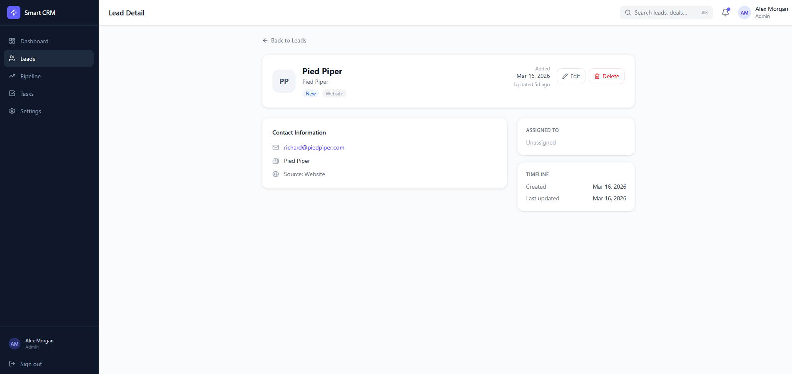

# Smart CRM – AI-Ready Customer Management System

> A production-quality CRM for small and medium businesses — built to manage clients, track deals, and automate workflows. Ready for AI agent integration.

[](https://frontend-peach-mu-96.vercel.app)
[](https://smart-crm-api-production.up.railway.app/health)
[](#tech-stack)

---

## 🚀 Overview

Smart CRM is a full-stack customer relationship management system that helps small and medium businesses:

- **Manage contacts and leads** — never lose track of a potential client
- **Track the sales pipeline** — see every deal and its current stage at a glance
- **Assign and complete tasks** — keep the team aligned and accountable
- **Monitor performance** — dashboard with key metrics, activity feed, and pipeline charts
- **Automate and integrate** — REST API ready to connect with AI agents, Zapier, n8n, or any external service

Built as a real product — not a tutorial — with clean architecture, role-based access, and live deployment.

---

## 🎯 Problem & Solution

### The Problem

Small businesses often manage clients in spreadsheets, chat history, or scattered notes. This leads to:
- Missed follow-ups and lost deals
- No visibility into sales pipeline health
- Tasks falling through the cracks
- Zero automation — everything is manual

### The Solution

Smart CRM centralizes everything in one place:

| Before | After |
|--------|-------|
| Clients in spreadsheets | Structured contact + lead database |
| "I'll remember it" follow-ups | Task system with priorities and deadlines |
| Unknown pipeline status | Visual Kanban board with deal stages |
| Manual status updates | API-driven automation hooks |
| No team coordination | Role-based access for Admin / Manager / Viewer |

---

## 🧠 Key Features

### 📋 Contact & Lead Management
Create, search, filter, and update leads with status tracking (New → Qualified → Proposal → Closed). Assign leads to team members and add context notes.

### 🏗 Deal Pipeline (Kanban)
Visual drag-and-drop Kanban board with 5 deal stages. Move deals between stages, track deal value, and see where revenue is concentrated.

### ✅ Task Management
Create tasks linked to leads and deals. Set priorities (High / Medium / Low), assign owners, and mark as complete. Filter by status and due date.

### 📊 Live Dashboard
Real-time stats cards, pipeline distribution bar chart, recent activity feed, and latest leads table — all in one view.

### 🔐 Role-Based Access Control
Three built-in roles: **Admin** (full access), **Manager** (create/edit), **Viewer** (read-only). Enforced both on the frontend and the API level.

### ⚡ API-First Architecture
Every feature is exposed through a clean REST API. Designed for integration with external tools, AI agents, and automation platforms.

---

## 🤖 Automation & AI Integration

Smart CRM is designed from day one to be **AI-ready**. The REST API makes it trivial to connect intelligent agents and automation workflows.

### Example Use Cases

**AI Lead Scoring Agent**
Connect an AI agent (e.g., Claude, GPT-4) that reads new leads via `GET /api/leads`, scores them based on industry and source, and updates their status automatically via `PUT /api/leads/{id}`.

**Automated Follow-Up Tasks**
Use n8n or Make (Integromat) to trigger `POST /api/tasks` whenever a deal sits in one stage for more than 3 days — ensuring no deal goes cold.

**Email Campaign Sync**
Pull qualified leads via `GET /api/leads?status=Qualified` and push them to Mailchimp, ActiveCampaign, or a custom email service.

**AI Meeting Summarizer**
After a call, send a transcript to an AI model and auto-create a note on the lead record via `PUT /api/leads/{id}` — updating the activity feed in real time.

**Roadmap: Built-In AI Assistant**
A future version will include an embedded AI assistant for lead enrichment, deal risk analysis, and smart task suggestions directly in the UI.

```
External Tools → REST API → Smart CRM
     ↑                           ↓
  AI Agents ←────── Activity Feed + Webhooks
```

---

## 🛠 Tech Stack

| Layer | Technology | Notes |
|-------|-----------|-------|
| **Frontend** | Next.js 16, TypeScript, Tailwind CSS | App Router, feature-based structure |
| **Backend** | ASP.NET Core 9, Clean Architecture | Controllers → Core → Infrastructure layers |
| **Database** | PostgreSQL | Hosted on Railway |
| **Auth** | ASP.NET Identity + JWT | Role-based, token-based |
| **Deploy** | Vercel + Railway | CI/CD via GitHub push |

### Architecture Highlights
- **Clean Architecture** on the backend: API layer, Core (entities + interfaces), Infrastructure (EF Core + repositories)
- **Feature-based frontend** structure: `features/leads`, `features/deals`, `features/tasks` — each self-contained
- **JWT authentication** with role claims — same token used for both UI and API consumers
- **Seeded demo data** — instantly runnable with realistic business data out of the box

---

## 📸 Screenshots

### Dashboard

> Stats cards, pipeline chart, activity feed, and recent leads — all in one screen.

### Lead Pipeline (Kanban)

> Drag-and-drop deal board with 5 stages: New → Qualified → Proposal → Negotiation → Closed.

### Leads Table

> Filterable, searchable leads table with status badges and quick actions.

### Lead Detail Page

> Full contact info, notes, related tasks, and activity history for each lead.

*Note: Screenshots are placed in `docs/screenshots/`. Run the app locally or visit the [live demo](https://frontend-peach-mu-96.vercel.app) to see it in action.*

---

## 🔑 Demo Accounts

Try the live demo with these credentials:

| Role | Email | Password | Access |
|------|-------|----------|--------|
| **Admin** | admin@smartcrm.demo | Demo@123! | Full access |
| **Manager** | sarah@smartcrm.demo | Demo@123! | Create & edit |
| **Viewer** | emily@smartcrm.demo | Demo@123! | Read-only |

---

## 🧪 How to Run Locally

### Prerequisites
- Node.js 18+
- .NET 9 SDK
- PostgreSQL (local or Docker)

### 1. Clone the repository

```bash
git clone https://github.com/your-username/Smart-CRM.git
cd Smart-CRM
```

### 2. Start the backend

```bash
cd backend/SmartCRM.API
```

Create `appsettings.Development.json` (or edit `appsettings.json`):

```json
{
  "ConnectionStrings": {
    "DefaultConnection": "Host=localhost;Database=SmartCRM;Username=postgres;Password=postgres"
  },
  "JwtSettings": {
    "Secret": "your-secret-key-at-least-32-chars",
    "Issuer": "SmartCRM",
    "Audience": "SmartCRM"
  }
}
```

```bash
dotnet run
# API starts at http://localhost:5103
# Demo data is seeded automatically on first run
```

### 3. Start the frontend

```bash
cd frontend
npm install
```

Create `frontend/.env.local`:

```env
NEXT_PUBLIC_API_URL=http://localhost:5103
```

```bash
npm run dev
# App starts at http://localhost:3000
```

Open [http://localhost:3000](http://localhost:3000) and log in with any demo account above.

---

## 📁 Project Structure

```
Smart-CRM/
├── backend/
│   ├── Dockerfile
│   ├── railway.toml
│   ├── SmartCRM.API/
│   │   ├── Controllers/        # Auth, Leads, Deals, Tasks, Dashboard
│   │   ├── Extensions/         # Service registration, middleware
│   │   └── Program.cs
│   ├── SmartCRM.Core/
│   │   ├── Entities/           # Lead, Deal, Task, User, Activity
│   │   ├── Interfaces/         # Repository contracts
│   │   └── DTOs/               # Request/Response models
│   └── SmartCRM.Infrastructure/
│       ├── Data/               # EF Core DbContext, migrations
│       ├── Repositories/       # Concrete implementations
│       └── Seeder/             # Demo data seed
└── frontend/
    └── src/
        ├── app/
        │   ├── (dashboard)/    # Auth-protected pages (sidebar layout)
        │   │   ├── dashboard/
        │   │   ├── leads/
        │   │   ├── deals/
        │   │   ├── tasks/
        │   │   └── settings/
        │   └── login/
        ├── features/           # Self-contained feature modules
        │   ├── dashboard/
        │   ├── leads/
        │   ├── deals/
        │   └── tasks/
        ├── components/         # Shared UI (Sidebar, Header, StatusBadge)
        ├── services/           # API layer (axios)
        ├── lib/                # Axios instance, AuthContext
        └── types/              # TypeScript interfaces
```

---

## 🌐 API Reference

Base URL: `https://smart-crm-api-production.up.railway.app`

| Method | Endpoint | Auth | Description |
|--------|----------|------|-------------|
| `POST` | `/api/auth/login` | Public | Login, returns JWT |
| `GET` | `/api/auth/me` | Any | Current user info |
| `GET` | `/api/auth/users` | Admin, Manager | List all users |
| `POST` | `/api/auth/register` | Admin | Register new user |
| `GET` | `/api/leads` | Any | List leads (filter by status/assignee) |
| `POST` | `/api/leads` | Manager+ | Create new lead |
| `GET` | `/api/leads/{id}` | Any | Lead detail with notes |
| `PUT` | `/api/leads/{id}` | Manager+ | Update lead |
| `DELETE` | `/api/leads/{id}` | Admin | Delete lead |
| `GET` | `/api/deals` | Any | List all deals |
| `POST` | `/api/deals` | Manager+ | Create new deal |
| `PATCH` | `/api/deals/{id}/stage` | Manager+ | Move deal stage |
| `GET` | `/api/tasks` | Any | List tasks |
| `POST` | `/api/tasks` | Manager+ | Create task |
| `PATCH` | `/api/tasks/{id}/complete` | Any | Toggle task complete |
| `GET` | `/api/dashboard/stats` | Any | Dashboard metrics |
| `GET` | `/api/activity` | Any | Recent activity feed |
| `GET` | `/health` | Public | API health check |

---

## 🎯 Why This Project Matters

This isn't a tutorial project. It's built to mirror real software that businesses actually pay for.

**For businesses:** A small sales team at a 10-person company has immediate ROI from this system — organized leads, no missed follow-ups, and clear pipeline visibility. No expensive Salesforce subscription required.

**For developers:** The architecture demonstrates practical patterns — Clean Architecture on the backend, feature-based structure on the frontend, JWT auth, role-based access, and a REST API ready for real integrations.

**For freelancers and agencies:** This is the kind of internal tool clients ask for every week. A custom CRM tailored to a business's workflow is a common and profitable project type. This codebase is a production-ready starting point.

---

## 🔮 Roadmap

| Feature | Status |
|---------|--------|
| Core CRUD (leads, deals, tasks) | ✅ Done |
| Kanban deal pipeline | ✅ Done |
| Role-based access control | ✅ Done |
| Live deployment (Vercel + Railway) | ✅ Done |
| Email notifications on task due | 🔜 Planned |
| AI lead scoring assistant | 🔜 Planned |
| Analytics dashboard (charts + trends) | 🔜 Planned |
| Zapier / n8n webhook integration | 🔜 Planned |
| Mobile-responsive layout improvements | 🔜 Planned |
| Custom pipeline stages per team | 🔜 Planned |

---

## 👤 Author

Built by a full-stack developer focused on business tools, internal systems, and AI-powered automations.

Open to freelance projects — [reach out via GitHub](https://github.com/your-username).

---

*Smart CRM — because every business deserves a system that works as hard as they do.*
